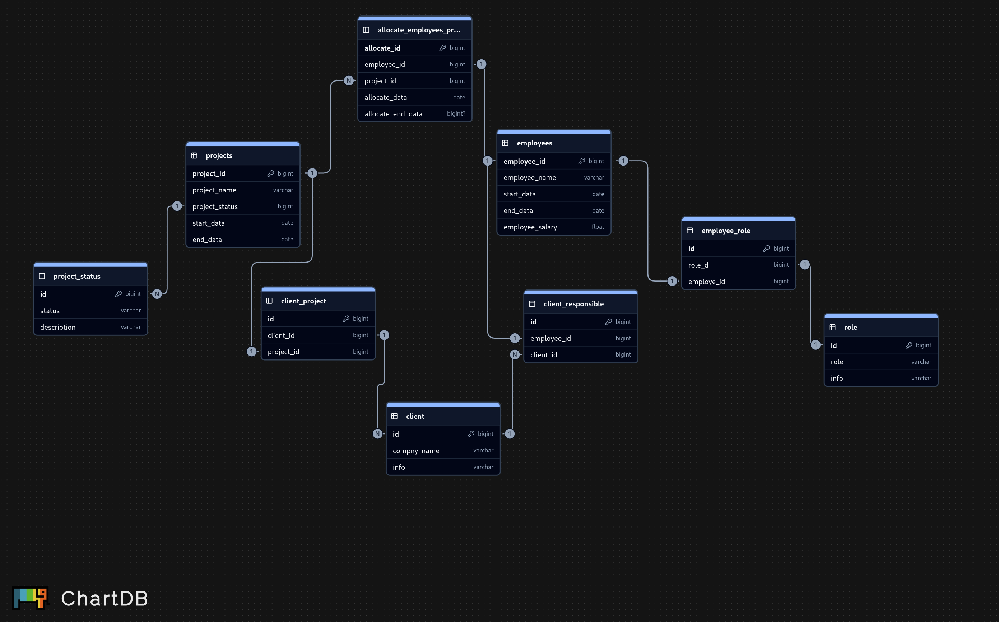

## 1. Pesquisa sobre SGBDs
Pesquisei superficialmente os bancos de dados apresentados, mas escolhi me aprofundar um pouco mais no Oracle Database. Ele é um SGBD muito robusto e seguro, amplamente utilizado em grandes empresas (bancos, seguradoras, empresas de telecomunicação etc) onde falhas não são aceitáveis. Seus principais pontos positivos são: altíssimo desempenho, confiabilidade e escalabilidade. Já seus pontos negativos incluem o custo extremamente elevado e a alta complexidade de administração.

## 2. Script SQL Prático
[Ver script SQL](2.script_sql_pratico.sql)

## 3. Modelagem de Sistema

## 4. Leitura Complementar
Fazer no bus voltando para casa

## 5. Reflexão Crítica
O excel é uma ferramenta acessível, prática e visual, ideal para pequenos conjuntos de dados ou tarefas individuais. Permite criar diversos mecanimos sem a necessidade de conhecimentos em programação. Por essas características acava se tornando muito popular em empresas de pequeno porte ou com baixa necessidade de dados. Quando ultrapassa os limites tecnicos, pode gerar: planilhas grandes podem se tornar lentas, difíceis de organizar e propensas a erros humanos.
Já em um BDD é ideal para armazenar, organizar e consultar grandes volumes de dados de forma estruturada e segura. Permite trabalhar com múltiplas tabelsa, realizar consultas complexas, automatizar operações e garantir integridade dos dados. Além disso, bbds suportam múltiplos usuários simultaneamente e possibilitam integrações com sistemas externos. A desvantagem é não são tao visuais como uma planilha, precisa de um maior conhecimento técnico.
Portanto, a escolha entre Excel e bdds depende muito do seu escopo de projeto. Para pequenas análises rápidas ou tarefas individuais, o execel é mais doque suficiente. Já em ambientes corporativos com grandes volumes de dados, multiplos usuários, necessidades de segurança, consultas complexas o usso do bdd é mais recomendada. Em alguns casos as duas ferramentas podem trabalhar junto, trazendo dados de um bbd e analizando visualmente no excel, assim tendo o melhor dos dois mundos.
Em resumo, é um projeto pequeno, ou individual, utilize execel por ter menos complexidade e mais apelo visual. Se for um projeto com necessidade mais robusta e segura, utilize um bdd.

## 6. Prática com Dataset Real
