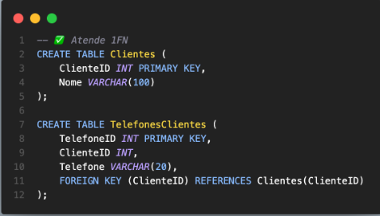

## Modelagem Ninja (27/09/25)

### Relembrando

#### Oque é DDL, DML e Constrains

DDL (Data definition language)
-> Controle de estruturas do banco de dados. Exemplo Create Table, Alter Table, Drop Table.

DML (Data modification language)
-> Conjunto de comandos que manipulam dados. Exemplo
Inserto into alunos(...), UPDATE alunos, DELETE FROM alunos where ...

Constrains
-> Regras aplicadas às colunas. Exemplo PK(primary key), FK(foreing key), NOT NULL, UNIQUE, CHECK (idade >= 0)

### Minhas Anotações/Pesquisas

#### O que é Normalização ?
-> É um processo de organizar tabelas de um banco de dados relacional para reduzir a redundância (evitar dados repitidos) e garantir integridade (consistencia).

#### Primeira Forma normal
Regra: cada coluna deve ser atômica(sem valores múltiplos ou listas), e cada linha única.
Errado:

Correto:

#### Segunda Forma Normal
Regra: 1FN + todos os atributos não-chave dependerem da chave primária inteira
Errado:

Correto:

#### Terceira Forma Normal
Regra: estar na 2FN e não ter dependência transitiva.
Errado:

Correto:

#### Normalização x Desnormalização

Dados íntegros        Consultas rápidas
Sem redundância       Relatórios Simpl
Atualizações Fáceis   Menos Joins
                      Dados Duplicados
